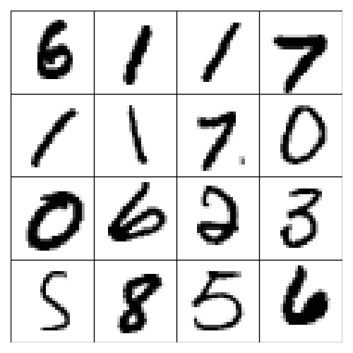
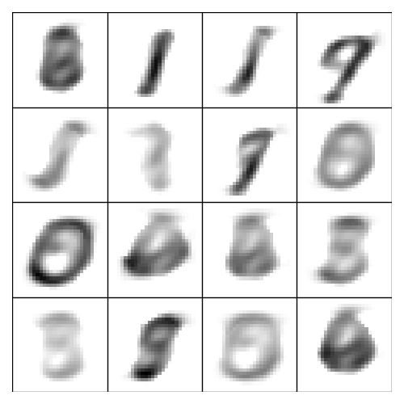

# Evo-Discrete-MF

A high-performance Discrete Matrix Factorization solver using an evolutionary algorithm combined with localized coordinate descent. This project includes a Python implementation with a C++ extension for performance-critical operations.

## Features

- **Matrix Factorization Modes**:
  - **IMF** (Integer Matrix Factorization): Standard integer factorization.
  - **BMF** (Boolean Matrix Factorization): Factorization for boolean/binary matrices.
  - **RELU**: Factorization with ReLU constraints.
- **Hybrid Solver**: Combines a global evolutionary metaheuristic with a fast C++ Local Search agent.
- **Optimized C++ Extension**: Includes a custom C++ module (`fast_solver`) using Eigen and OpenMP for parallelized coordinate descent.

## Installation

### 1. Prerequisites
- Python 3.8+
- C++ Compiler (supporting C++11 or higher, e.g., MSVC on Windows, GCC/Clang on Linux)
- [Optional] OpenMP support for parallelization

### 2. Install Python Dependencies
Install the required Python packages using pip:

```bash
pip install -r requirements.txt
```

*Note: `pybind11` and `numpy` are required for compiling the C++ extension.*

### 3. Compile the C++ Solver
The performance-critical section of the solver is written in C++. You must compile it before running the project.

Run the following command from the project root:

```bash
python src/cpp_solver/setup.py build_ext --inplace
```

After compilation, verify that the compiled extension file (e.g., `fast_solver.cp3X-win_amd64.pyd` on Windows or `.so` on Linux) is located in the `src/` directory. If it is in `src/cpp_solver/`, move it to `src/`:

```bash
# Windows
move src\cpp_solver\fast_solver.*.pyd src\

# Linux / Mac
mv src/cpp_solver/fast_solver.*.so src/
```

## Usage

Run the `main.py` script to solve a matrix factorization problem.

```bash
python main.py -i <input_file> -o <output_file> [OPTIONS]
```

### Examples

**Run BMF on the 'zoo.txt' dataset:**
```bash
python main.py -i data/bmf_matrix/zoo.txt -o results/zoo_sol.txt -r 5 --factorization-mode BMF
```

**Run IMF with a time limit of 60 seconds:**
```bash
python main.py -i data/imf_matrix/instance_1.txt -o results/sol_1.txt -r 10 -t 60.0 --factorization-mode IMF
```

### Command Line Arguments

| Argument | Flag | Type | Default | Description |
|----------|------|------|---------|-------------|
| **Input** | `-i`, `--input` | str | **Required** | Path to the input matrix file. |
| **Output** | `-o`, `--output` | str | **Required** | Path where the solution (W, H, Error) will be saved. |
| **Rank** | `-r`, `--rank` | int | `10` | The factorization rank (inner dimension size). |
| **Time Limit** | `-t`, `--time_limit` | float | `300.0` | Maximum execution time in seconds. |
| **Mode** | `--factorization-mode` | str | `IMF` | Factorization mode: `IMF`, `BMF`, or `RELU`. |
| **Population** | `-n`, `--population_size` | int | `50` | Size of the population for the genetic algorithm. |
| **Seed** | `--seed` | int | `None` | Random seed for reproducibility. |
| **Debug** | `--debug-mode` | flag | `False` | Enable verbose debug output. |

## File Formats

### Input Format (IMF/RELU)
The first line contains the metadata: `m n LW UW LH UH`.
- `m`, `n`: Dimensions of matrix X (m rows, n columns).
- `LW`, `UW`: Lower and Upper bounds for matrix W.
- `LH`, `UH`: Lower and Upper bounds for matrix H.
The following `m` lines contain the integer values of the matrix X row by row.

### Input Format (BMF)
The first line contains the metadata: `m n`.
- `m`, `n`: Dimensions of matrix X.
(Bounds are automatically set to 0 and 1).
The following `m` lines contain the binary values of the matrix X row by row.

### Output Format
The output file will contain:
1. The final objective function value (Error).
2. The matrix W (m rows).
3. The matrix H (r rows).

### Exemple of experiment

## ReLU 

<table>
  <tr>
    <td align="center">
      
      <br />
      <b>Original Images</b><br>
    </td>
    <td align="center">
      
      <br />
      <b>ReLU-NMD r=5 0.43 MB</b><br>
    </td>
    <td align="center">
      
      <br />
      <b>I-ReLU-NMD r=40 0.43 MB</b><br>
    </td>
  </tr>
</table>

## IMF

<table>
  <tr>
    <td align="center">
      
      <br />
      <b>QMF r=40 bounds=[0,15]</b><br>
    </td>
    <td align="center">
      
      <br />
      <b>EvoMF r=40 bounds=[0,15]</b><br>
    </td>
  </tr>
</table>

## Project Structure

```
Evo-Discrete-MF/
├── data/                   # Input datasets
├── experiments/            # Output solutions
├── src/                    # Source code
│   ├── cpp_solver/         # C++ source code & setup script
│   ├── solver.py           # Main metaheuristic logic
│   ├── init_pop.py         # Population initialization
│   ├── local_search.py     # Python wrapper for local search
│   └── fast_solver.pyd     # Compiled C++ extension (must be here)
├── utils/                  # Helper functions (I/O, verification)
├── scripts/                # Helper scripts (calc error, visualize)
├── main.py                 # Main entry point
└── requirements.txt        # Python dependencies
```